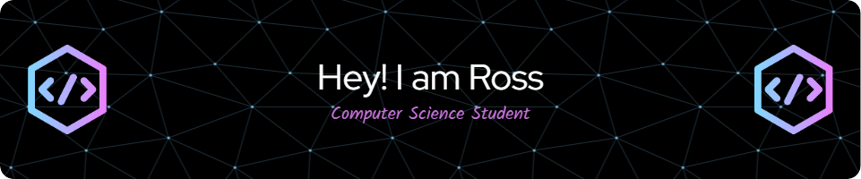

    <h1>
    👇 About Me 👇
    </h1>
        

            I am a Computer Science Student
        

    <h1></h1>

    <h1>
          Skill Set  
        

        

            
            &nbsp;
            &nbsp;
            
            &nbsp;
            &nbsp;
            
            &nbsp;
            &nbsp;
            
            &nbsp;
            &nbsp;
            
        

        

            
        

        

            
        

    </h1> 

    <h1>
    Recent Projects
    </h1>   
       

           
Project 1: 
               
               - Dice Game made with Python that displayes the rolled number as LED'S using a GPIO Hat
           

       

    

           
Project 2: 
               
               - Basic car simulator created using OOP in Python
           

    

    

           
Project 3: 
               
               - Rock Paper Scissors game made using CPP
           

    

    

           
Project 4: 
               
               - Basic vector practice using pushback
           

    

    <h1>
    hobbies
    </h1>  
        

            I am a Computer Science Student
        
  

